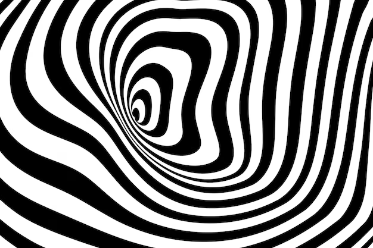

# Huffman Compression Algorithm Implementation

## Discrete Fa 2023

### Instructions
To run this script install necessary packages listed in ```requirements.txt```

And run ```python3 huffman.py```

Default image: 


Optional command line argument: custom image filepath ex ```python3 huffman.py mickey.jpg```

Example Output
```
Loading in image:  spiral.png
Converting to grayscale
Flatten image into 1d array
Creating frequency list
Creating tree from bottom up
Populating tree edges with 0's and 1's for bitstring representations for intensity values: 
++++++++++++++++++++++++++++++++++++++
Saving bitstring representations: 
{0: '10',
 1: '1101',
...
 255: '0'}
++++++++++++++++++++++++++++++++++++++
Original Theoretical File Size:  261042 bytes * 8 bits =  2088336 bits
Theoretical encoded string size:  851846 bits
(+ neglible tree storage for a large volume of images)
Compression ratio:  26.10602125328491 %
++++++++++++++++++++++++++++++++++++++
Checking Decoding against original image using tree: 
Decoded Successfully!

```